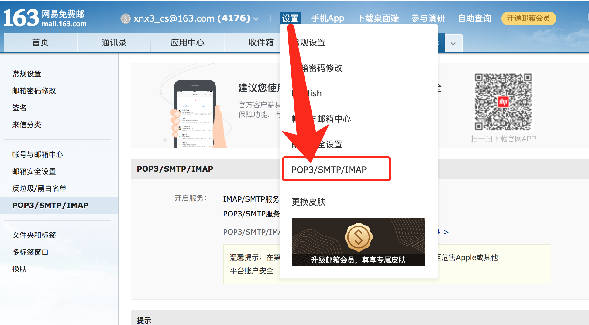
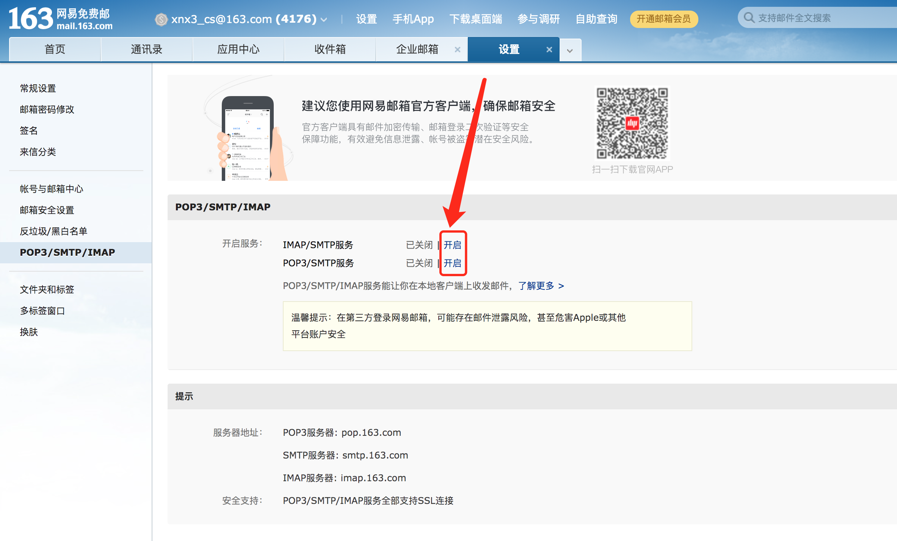

Java中，一行代码实现邮件发送。你无需关注它是怎么发送的，你只需会传参数就可以了。

## 代码使用

#### 1. pom.xml 中加入

````
<!-- 邮件发送 https://gitee.com/mail_osc/email.java -->
<dependency> 
	<groupId>cn.zvo.email</groupId>
	<artifactId>email</artifactId>
	<version>1.0</version>
</dependency>
````

#### 2. Java代码
````
String host = "smtp.163.com";
String username = "xnx3_cs@163.com"; //您的163邮箱
String password = "您邮箱的登录密码";

Email mail = new Email(host, username, password); //创建
mail.sendHtmlMail("mail@xnx3.com", "邮件的标题", "邮件的内容"); //给 mail@xnx3.com 的邮箱发送一封邮件
````

## 申请免费的邮箱用于发邮件
这里以网易163邮箱为例说明  

#### 1. 注册163邮箱
注册/登录地址 [https://mail.163.com/](https://mail.163.com/)  
注册完后，登录进入邮箱管理  

#### 2. 账号设置
要开启smtp服务，如下图所示  
  
  

#### 3. 获取smtp的服务器地址
如上个步骤中图片所示，可看到smtp的服务器地址为  

````
smtp.163.com
````

这个要是别的邮箱，一般也都是以smtp开头，如  smtp.xxxx.com

#### 4. 代码中使用
获取到 smtp的host、有了邮箱账号、登录邮箱的密码，就可以愉快的一行代码发送邮件了。